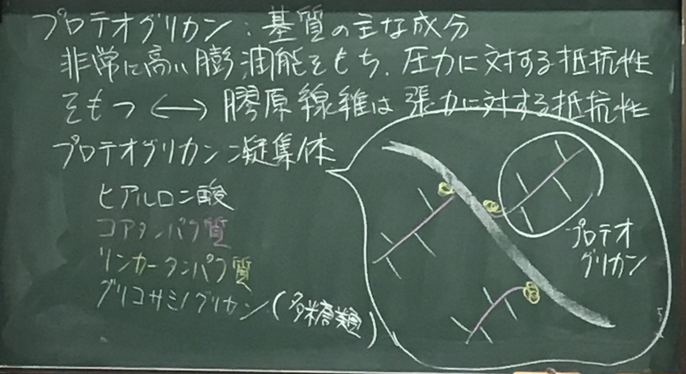

注：筋の続きは4/3のノートに記載。

# 支持組織

* 要点
    * 支持組織の分類、結合組織の分類
    * 結合組織を構成する線維と基質について

## 支持組織

体や組織の形を支持する枠組みとして働く

* 細胞間質が非常に豊富で細胞がそれに埋もれるような組織（ex. 骨、軟骨、結合組織など）
    * 上皮にはほとんど細胞間質はない
* 組織の硬さ・弾力を決める上で重要。

### 細胞間質の構成成分

* 線維：　　膠原線維、細網線維、弾性線維
* 基質：　　タンパク質と多糖類を多く含む

### 支持組織の分類

1. 結合組織　　　・・・　間質は主に膠原線維
    1. 線維性結合組織（疎性結合組織、強靭結合組織）
    1. 膠様線維
    1. 細網組織
    1. 脂肪組織
1. 軟骨組織　　　・・・　間質は主に軟骨質と膠原線維
1. 骨組織　　　　・・・　間質は主に骨質と膠原線維
1. 血液とリンパ　・・・　間質は主に液体

#### 1. 線維性結合組織について

##### 疎性結合組織
* ゲル状の細胞外基質中に線維と細胞がまばらに存在。（ex. 皮下組織、粘膜下組織など）

##### 強靭（密性）結合組織
* 柱状、ひも状、膜状など一定の形をなす線維性結合組織。非常に強靭。
* ex.
    1. 線維の方向が平行：　腱、靭帯
    1. ２次元的に交織：　筋膜、腱膜
    1. ３次元的に交織：　真皮、強膜、角膜

#### 2. 膠様組織について

* 胎児にみられる透明で基質に富む結合組織 （ex. 臍帯の結合組織）
* 突起を伸ばした細胞が散在する

#### 3. 細網組織について

* 細網細胞と細網線維の網からなる組織
* 免疫系の組織（リンパ節、脾臓、胸腺など）

#### 4. 脂肪組織

* 脂肪細胞が集合してできる組織

| --- | 白色脂肪 | 褐色脂肪 |
| :---: | :---: | ---: |
| 脂肪滴 | 細胞の大部分が１つの脂肪滴 | 多数の小脂肪滴 |
| ミトコンドリア | 少ない | 多い（白色の約1000倍） |
| 肉眼での色 | 黄色 | 褐色 |
| 機能 | エネルギーの貯蔵 体腔の空隙を埋める（クッション） 内分泌（レプチン、アディボネクチンなどを分泌） | 熱産生 |
| 分布 | 皮下 | 首の後ろ、肩甲骨周辺、腎周囲 |

### 結合組織内の細胞について

* 線維芽細胞（fibroblast）
    * 最も多く重要な細胞
    * タンパク質分泌細胞：　基質と線維を分泌（コラーゲン、エラスチン、プロテオグリカンなど）
    * 長楕円形の核を持つ紡錘状の細胞
    * 細胞質は非常に薄い
* その他の主な細部
    * マクロファージ：　貪食作用あり
    * 形質細胞：　Bリンパ球から分化し、免疫グロブリンを大量に合成分泌
        * 核：　核小体（rRNA）が大きい、多数　→ 車軸核
        * 細胞質：　粗面小胞体が発達。多量のリボソーム・mRNAのため好塩基性（HEで紫色）

### 結合組織を構成する線維

* 膠原線維
    * HE染色で薄い赤色
    * 引っ張りに強い
    * コラーゲン細線維（原線維）の束
    * ほとんどの結合組織に存在するが、特に骨、軟骨、腱、靭帯に多い
* 細網線維
    * Ⅲ型コラーゲンからなる
    * 鍍銀法で黒く染まる
    * 疎性結合組織の中に混在
    * 基底膜、細網組織に多い
        * 基底膜：　上皮が結合組織に接する場所。脂肪細胞、平滑筋、横紋筋を包む
* 弾性線維
    * 弾性に富む、ゴムのように伸びる、枝分かれ多い
    * 皮膚・血管壁・肺に多い
    * HE染色で染まらず、無色透明に見える

### コラーゲンの合成・分泌・重合について

* プロコラーゲン：　粗面小胞体で合成される  
↓ 小胞体、ゴルジ体で、プロリン・リジンが水酸化（-OH）　→コラーゲンの自己凝集に必要  
↓ 水酸化にビタミンCが必要　→ ビタミンC不足で壊血病
* プロコラーゲン：　細胞内で３量体を形成  
↓ 小胞に詰め込まれ、細胞外に分泌  
↓ （⭐︎）螺旋を作らない部分は酵素で除去される
* トロポコラーゲン  
↓ ずれながら自己凝集　→ 線状パターンになる
* コラーゲン細線維（原線維）  
↓ 隣同士が架橋
* コラーゲン線維

#### 疾患との関連
* エーラー・ダンロス症候群：　☆のプロセス異常
    * コラーゲン分子の強度↓
    * 皮膚の過伸展、動脈瘤など

### 弾性線維の合成・分泌・重合について

構成成分３つ：　プロエラスチン、フィブリリン1,2、微細線維関連糖タンパク質（MAGP）  
これらが細胞外に分泌されて重合する

* プロエラスチン  
↓ 分泌
* トロポエラスチン  
↓ フィブリリン1,2、MAGPと会合
* 未成熟弾性線維  
↓ さらに会合
* 成熟弾性線維

#### 疾患との関連

* マルファン症候群：　フィブリリン１、２遺伝子異常
    * 近視、骨格異常（指長い、身長高い）、動脈瘤

### 基質（細胞外マトリックス、ECM）

* 細胞や結合組織の線維の周囲に存在
* コラーゲン、非コラーゲン性糖タンパク質、プロテオグリカンから成る
    * コラーゲン：　非線維性のもの
    * 非コラーゲン性糖タンパク質（フィブロネクチン、ラミニンなど）
        * 基底膜などに包まれ、細胞と基質の結合を強くする
    * プロテオグリカン：　基質の主な成分
        * 非常に強い膨潤能を持ち、圧力に対する抵抗性を持つ  
        ↔︎ 膠原線維は張力に対する抵抗性

> * プロテオグリカン凝集体　＝　ヒアルロン酸（軸）＋リンカータンパク＋プロテオグリカン
> * プロテオグリカン　＝　コアタンパク＋グリコサミノグリカン

#### グリコサミノグリカン（GAG）
* 二糖類の直鎖状重合体（70〜200回の繰り返し構造）
* アグレカンの場合：　コンドロイチン硫酸 or ケラタン硫酸
    * コンドロイチン硫酸　＝　D-グルクロン酸とN-アセチル-D-ガラクトサミン　の反復構造に硫酸基が結合したもの
    * ケラタン硫酸　＝　D-がラクトースとNアセチル-D-グルコサミン　の反復構造に硫酸基が結合したもの