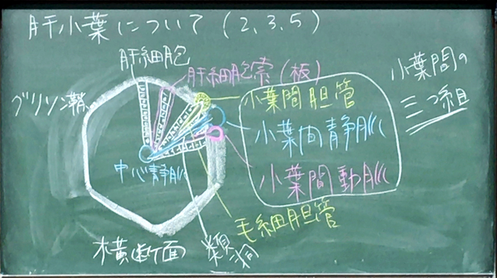
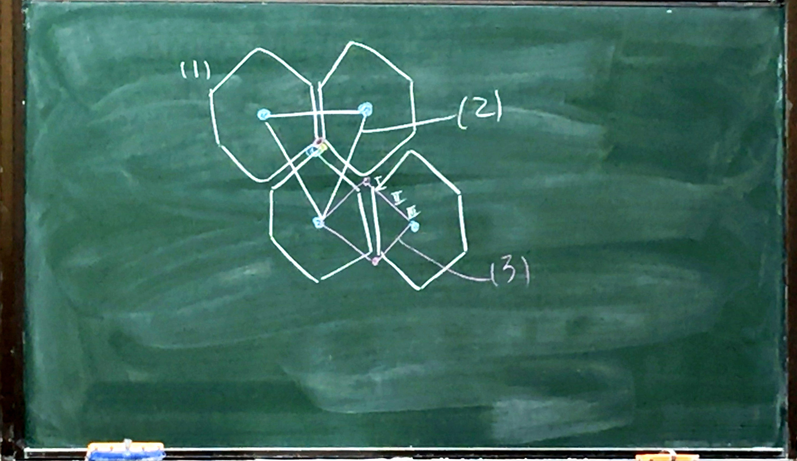
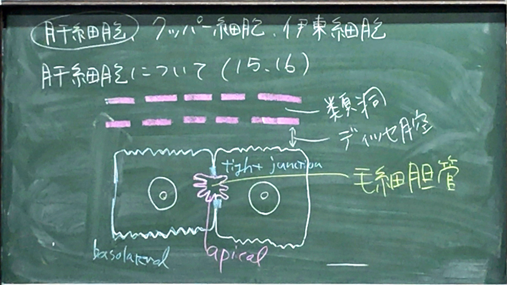
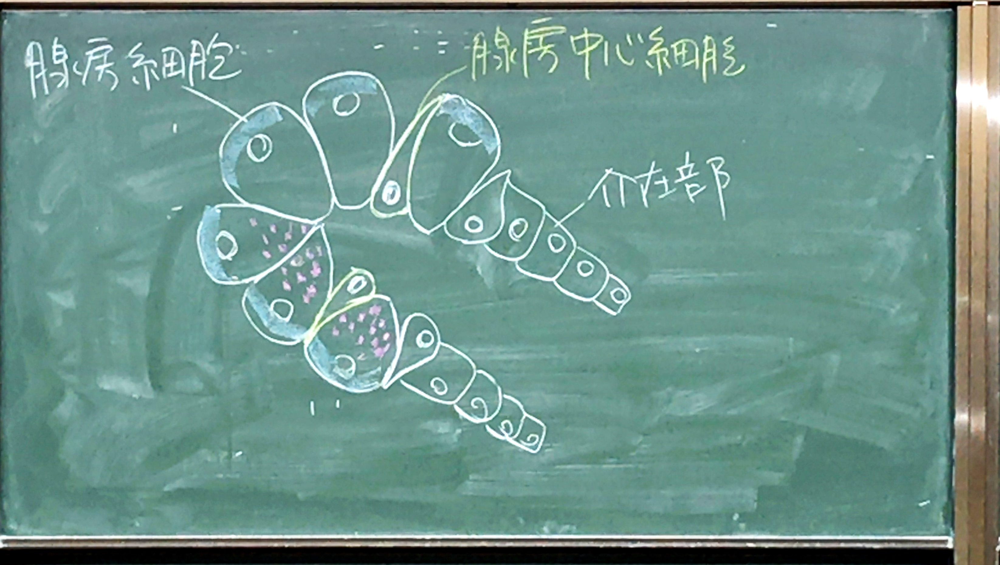

# 肝臓

* 機能: 胆汁分泌、栄養の貯蔵、代謝、解毒、血球の破壊
* 表面はほとんど漿膜に覆われ、その下に膠原線維、弾性線維の**結合組織**（＝グリソン嚢）  
→その続き肝臓内に入り込み小葉間結合組織（グリソン鞘）となって肝の実質を無数の肝小葉に分ける。（プリント#1,#2）

肝小葉について（プリントNo.1の#2,3,5と同じ）

> 三つ組構造はプリント#4を参照

### 肝小葉

* 肝臓の構造上、機能上の単位　径0.5〜2mm、高さ: 0.5〜2mmの六角形/多角形
* 中心静脈を囲んで、肝細胞が放射状に配列　→ 肝細胞索（板）
* 胆汁：  肝細胞と肝細胞の間の毛細胆管によって遠心性に流れる
* 血液：　肝細胞索の間の空隙を洞様毛細血管（類洞）によって求心性に流れる。
* 小葉間動脈：　壁厚く、管腔狭い、血液量 20〜25%
* 小葉間静脈：　壁薄く、管腔広い、門脈（血液量の75〜80%）
* 小葉間胆管：　単層立方上皮で構成される毛細胆管に由来

> ここの流れは勉強しといたほうがよいかもしれません。
> ここの血管、胆管の走行は重要かもしれません。
> ちなみに私は去年の問題は作成していません。（先生）

### 血管系

* 小葉間動脈：　　動脈血で酸素が多い
* 小葉間静脈：　　腸管からの栄養に富む。類洞に入ると小葉間動脈と混ざる。
* 類洞 → 中心静脈　→ 小葉下静脈　→ 肝静脈　→ 下大静脈（参照：プリントNo.1 #11）

#### 洞様毛細血管について

* 一般の毛細血管より太い
* 肝細胞索と毛細血管内皮の間　＝　ディッセ腔
* 血管内皮に大小の窓が多数開いている。血漿がこの間を通って肝細胞に触れる。  
→ 血漿中のアミノ酸、グルコース、ビタミンなどを細胞内に取り込む。

> 洞様毛細血管は、 ~~今のところ有窓型で良い。あとで調べておく。~~ →不連続型。（先生）

### 胆道系
参照：プリントNo.1 #5, #11

* 胆汁：　肝細胞で産生　→ 毛細胆管　→ **ヘリング管**　→ 小葉間胆管　→左（右）肝管　→ 総胆管　→ 総胆管　⇄ 胆囊 → 十二指腸

> 覚え方：　小葉間のヘリにあるからヘリング管。

### 肝小葉の分類
参照：プリントNo.2 #13

1. 古典的肝小葉：　　中心静脈に類洞が収束する六角形
1. 門脈小葉：　　　　３つ組が中心
1. 肝腺房：　　　　　細動脈の終末枝によって決定。

|---|一帯|二帯|三帯|
|:--|:--|:--|:--|
|酸素と養分|多い|中間|少ない|

> 肝硬変において重要。酸素や養分が少ないため、三帯から傷害を受けやすい。

### 肝細胞、クッパー細胞、伊東細胞

#### 肝細胞について（プリントNo.2 #15, #16参照）

* 直径：　15〜30mm
* 消化管の上皮が落ち込んで増殖・分化
* HE染色で淡赤色　中央に丸く大きな核が１〜２個。核小体明瞭。
* グリコーゲン顆粒、脂肪滴が見られる
* ２つの幹細胞の境界線の中央に毛細胆管

> 他の細胞とつながっていたらそこがApicalになる

* 内分泌と外分泌を行う上皮細胞　→ apical, basolateralに分けられる
* apical（→外分泌）　: 毛細胆管に面する。微絨毛あり。両側にtight junctionがあり、胆汁の漏出を防ぐ。
* basolateral（→内分泌） : ディッセ腔に向かう微絨毛あり。血液由来物質の取り込み。血漿タンパク質（アルブミン、フィブリノゲン、プロトロンビン、凝固因子）の分泌

##### 肝細胞内の細胞内小器官（プリント#21, 22参照）

* 粗面小胞体：　高度に発達、血漿タンパクの合成
* 滑面小胞体：　高度に発達、グリコーゲン分解。脂質合成（コレステロール、胆汁酸など）
* ペルオキシゾーム：　H2O2を生成するオキシダーゼを多く含む。脂質合成に関与。

#### クッパー細胞（プリント#10）

* 血管内皮のところどころに存在。星形に突起を出す。
* 大食細胞の一種（プリント#27, #28, #30が取り込んでいる様子）

#### 伊東細胞

* ディッセ腔に存在
* 平常時：　脂肪の貯蔵、ビタミンA貯蔵、代謝
* 病的：　コラーゲン線維産生細胞になる。

> 群馬大学では伊東細胞の漢字を間違うと留年という噂。

##### 脂肪肝、アルコール性肝炎（プリント#31）

* エタノール・ウイルス、毒素の肝臓への侵入  
→ クッパー細胞：　TNF-α、TGF-βの産生↑  
→ TNF-αは炎症細胞を引き入れる（→炎症）  
→ TGF-βが伊東細胞のコラーゲン産生↑  
→ ディッセ腔にコラーゲン蓄積（線維化）  
→ 内皮細胞の窓が減る

> コラーゲンが窓を塞ぐ感じ。肝硬変になり、食道静脈瘤などを引き起こす。 

#### 胆汁について（プリント #34参照）

４つの機能

* 脂質（コレステロール、リン脂質、胆汁酸）、抱合ビリルビン　電解質排出
* 腸管内での脂肪吸収に関与
* IgAを腸粘膜に輸送
* 薬物代謝産物・重金属の排出

組成

* 有機成分：　胆汁酸、コレステロール、リン脂質
* 無機成分：　Na, Cl

##### 胆汁酸

コレステロールを排出するための主な機構

* 一次胆汁酸：　コレステロールから合成される
* 二次胆汁酸：　一次胆汁酸から腸内細菌によって作られる

##### 胆汁の流れ

* 十二指腸への流れ：　オッディの括約筋で調節
* 腸管内の脂質に反応して十二指腸の内分泌
* 細胞からコレシストキニンが分泌される
→ 胆囊の筋層収縮　＋　オッディの活躍筋弛緩　→ 胆汁が十二指腸へ

> 腹部エコーで空腹時だと胆囊が丸くよく見えるが、食事後だとあまり見えない。（先生）

> →ポカリスエットなども検査時に飲んではいかないのか。

> →腸の蠕動運動などでもCCKが出てしまうと思われる。（先生）

##### ビリルビン代謝（プリント No.4 #36参照）
* ヘモグロビン代謝産物（85%の老化赤血球由来）
* 非抱合型（間接）ビリルビンが血液中でアルブミンと結合  
→ 肝細胞へ入る  
→ 滑面小胞体でグルクロン酸抱合される。　＝　抱合（直接）ビリルビン  
→ 毛細胆管で胆汁に入って十二指腸へ  
→ 小腸遠位部、結腸で非抱合ビリルビン  
→ 更にウノビリノゲン  
→ 大部分は便として排泄

> 大便の色はこのウノビリノゲンの色。これが溜まってしまうと黄疸などになる。

#### 胆囊（プリント No.4 #38〜#40）

* 役割：　胆汁貯蔵、濃縮、放出
* 構造：　粘膜（上皮、固有層）、筋層、結合組織
    * 粘膜上皮：　丈の高い単層円柱上皮、細胞質はエオジン好性、細胞表面に微絨毛
    * 粘膜固有層：　弾性線維が多い
    * 筋層：　まばらな平滑筋の束。胃腸より薄い。
    * 結合組織（漿膜）：　かなり密、各種線維、血管、リンパ管、神経が豊富

> 実習でも見ません。テストもたぶん出ません。（先生）

# 膵臓

* 構造：　唾液腺に類似（プリントNo.1 #4参照）
* 表面を覆う結合組織が中に入り込み、数多くの小葉に分ける。
* 各小葉は多くの外分泌腺終末部とランゲルハンス島（内分泌部）からなる。

### 外分泌終末部（腺房）（プリント#7B参照）

* ほぼ球形
* 外分泌腺の基本単位
* 腺房細胞と腺房中心細胞からなる

#### 腺房細胞（プリント#2, #5参照）

* 円柱、くさび状
* 基底部寄りの球形の核
    * 基底部：　ヘマトキシリン好性（粗面小胞体が発達しているため。）
    * 上部（apical）：　エオジン好性の分泌顆粒が多い

##### 分泌顆粒

* 細胞のapical にあって直径0.5〜1.5μm
* 中に消化酵素（トリプシノゲン、キモトリプシノゲン、リパーゼ、アミラーゼ）を含む。

#### 腺房中心細胞（プリント #2, #3, #5参照）

* 介在部の細胞が終末部に入り込んだもの
* 腺房細胞より小さい
* HE染色で明るく染まる
* 分泌顆粒はない

##### 介在部（プリント #3, #4, #6）

* 重炭酸イオン分泌
* 終末部と導管の間にある細い部分
* 管腔狭く、単層立方〜扁平状の細胞からなる。

##### 導管（プリント #4）

* 介在部の続き　→ 小葉内導管　→ 小葉間導管　→ 主膵管　→ 十二指腸へ

### ランゲルハンス島（内分泌部）

* 内分泌細胞（下記）と毛細血管からなる。
    * α細胞：　グルカゴン
    * β細胞：　インスリン　80%
    * δ細胞：　ソマトスタチン
    * PP細胞：　膵ポリペプチド

##### インスリンについて（プリント #17）

* 6kDaのポリペプチド
* A鎖、B鎖がジスルフィド結合で結合
* プレプロインスリン  
→ 小胞体でシグナル配列が切断  
→ プロインスリン（A+B+C）  
→ 顆粒内で、Cペプチドが切断され、インスリンになる
* 血中のグルコース濃度上昇でインスリン分泌↑ → 血糖値を下げる

> 臨床：　インスリンとCペプチドが１対１で放出されるため、インスリン測定時は、Cペプチドを計測している

##### グルカゴン

* 血糖値低下で分泌
* 血糖値を上げる

##### ソマトスタチン

* インスリン、グルカゴンの分泌抑制

##### 膵ポリペプチド

* ソマトスタチン分泌抑制
* 消化酵素の分泌抑制