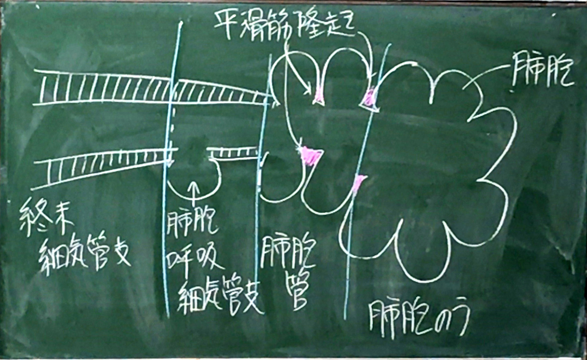
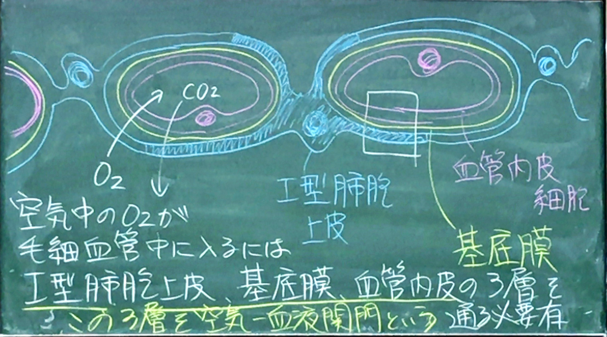

# 呼吸器系

```
要点
・器官〜肺胞はどのような細胞から構成され、どのような特徴を持つか？
・肺胞の構築、特に空気-血液関門とは何か？
```

* 気道部、呼吸部、換気機構の３部から成る
    * 気道部：　鼻腔から終末細気管支まで　→ 呼気や吸気の通り道（ガス交換）
    * 呼吸部：　呼吸細気管支・肺胞管、肺胞嚢、肺胞まで　→ 大気と血液の間のガス交換を行う部位
    * 換気機構：　胸郭、肋間筋、横隔膜、（肺の弾性結合組織）　→ 呼息、吸息に必要

## 鼻腔と副鼻腔

### ３つの役割

1. 空気の加温加湿
1. 吸気中の塵埃の除去
1. 嗅覚（嗅粘膜）


### 鼻腔（プリント No.1 #2）

* 鼻中隔で隔てられる
* 前庭、呼吸部、嗅部から成る
    * 前庭：　鼻腔に入ったすぐのところ
    * 呼吸部と嗅部：　前庭の奥
        * 嗅部：　鼻腔・鼻中隔の上部、鼻腔の外側壁
        * 呼吸部：　嗅部以外

#### 前庭

* ＝皮膚部：角化重層扁平上皮

#### 呼吸部

* 粘膜上皮：　杯細胞を伴う多列線毛上皮
* 粘膜固有層：　豊富な表在性静脈叢をもつ。海綿組織、漿液腺、粘液腺を持つ。

> 鼻の線毛は、後鼻腔（口のほう）に向かって動いている。


#### 嗅部

* 嗅上皮：　細胞４種：　基底細胞、幼若嗅ニューロン、支持細胞、成熟ニューロン
* 基底細胞（神経幹細胞）→ 幼若嗅ニューロン、成熟ニューロンへと分化

> 神経細胞は再生しないという説だったが、嗅の神経細胞だけは例外であった。

* 嗅ニューロン：高度の極性を持つ。（プリントNo.1 #4,5）
    * Apical：　粘膜表面に達し、10〜20本の線毛を持つ樹状突起球を作る
    * Basal：　軸索が出る　→ 嗅球へ向かう
* 嗅上皮下に嗅腺（ボーマン腺）がある
    * におい結合タンパク質（OBP）、IgA、リゾチームなどを分泌

### 副鼻腔（上顎、前頭、篩骨、蝶形骨洞）

* 内側は薄い多列線毛上皮

### 咽頭

* 鼻部：　後鼻孔から後ろ。多列線毛上皮
* 口部：　口蓋垂、口蓋弓から後ろ。非角化重層扁平上皮
    * 食道（C6（第６頚椎）の上食道括約筋）の上まで

### 喉頭

> 「喉」に縦棒は入っていないので注意

* 喉頭蓋から輪状軟骨まで
* 機能：　発声、誤嚥防止
* 領域：　声門上、声門、声門下領域（プリント #11）
* 粘膜上皮：　２種類
    * 重層扁平上皮：　外部との接触の多い部位、喉頭蓋の舌面と咽頭面の一部、声帯
    * 多列線毛上皮：　上以外の部位

> ものが接する場所は、基本的に重層扁平上皮

* 粘膜固有層：　
    * 疎性結合組織
    * 肥満細胞が多い
    * 腺（喉頭腺が声帯以外の場所にある）

> 肥満細胞はアナフィラキシーに関与。ヒスタミンにより浮腫を起こして気道を塞いでしまう。→ ステロイド注射か気道に穴を開ける

#### 声帯について

* 粘膜固有層は多量の弾性線維からなる
* 密な結合組織、その下に横紋筋が発達

## 気管

### 気管支の分岐と名称の変化

* 気管　→ 気管支（左右）　→ 細気管支　→ 終末細気管支　→ 呼吸細気管支　→ 肺胞管　→ 肺胞嚢　→ 肺胞
* 終末細気管支まで：気道部、それ以降：呼吸部

### 気管と気管支について

* 組織学的には共通
* 粘膜上皮：
    * 上皮細胞：　５種
        * 線毛細胞：　大多数、多数の線毛と微絨毛
            * 線毛は喉頭方向に動く
        * 杯細胞：　線毛なし（粘膜分泌）
            * 粘液：気道内を潤す。異物を包む　→ 排出
        * 基底細胞：　幹細胞、基底板（膜）に接するが、管腔に達しない
        * 刷子細胞：　表面に長い微絨毛を多数もつ（プリント #18,19）
        * 神経内分泌細胞（NE細胞：Neuro Endocrine）：　主に気管支の分岐部に分布。ホルモン分泌、酸素濃度検出：　迷走神経が分布。小細胞ガンの母体
* 上皮下には基底膜がある　→ 基底板と呼ぶ
* 粘膜固有層：
    * 膠原線維、多量の弾性線維（特徴）、血管・リンパ球豊富
    * 深部に気管腺（粘液・漿液性）がある

#### 気管と気管支の枠組み（外表面）

* 積み重なったC字型の硝子軟骨からなる

> 14の図は正確には正しくなく、線毛がまばらに生えている感じ

####  気管・気管支・細気管の違い：　軟骨の有無、形

| 気管 | 気管支 | 細気管支 |
| :--: | :--: | :--: |
| 軟骨輪（輪状） | 軟骨片（不定形） | 軟骨なし（ある場合もある） |

> だいたい試験に出るので覚えてもらっておいたほうがよい。

#### 細気管支と終末細気管支について

* 違い：　共に軟骨はなし。上皮の変化で区別する

|  | 細気管支 | 終末細気管支 |
| :--: | :--: | :--: |
| 線毛細胞 | 単層円柱上皮 | 単層立方上皮（丈が低くなる） |
| 杯細胞 | あり | なし |
| クララ細胞（クラブ細胞） | 少ない | 多い（全上皮細胞の80%）

##### クララ細胞について

* 最近はクラブ（club）細胞
* 線毛なし、円柱状、線毛細胞より丈が高い
* 滑面小胞体が極めてよく発達  
→ 脂質であるサーファクタント（界面活性剤）を合成・分泌

> クララが悪者であったことからクラブ細胞という名前に変える動きがある

##### 粘膜固有層（終末細気管支）

* 平滑筋線維・弾性線維が網状に発達

### 肺の呼吸部について

#### 呼吸細気管支

* 肺の気道部から呼吸部への移行部
* 肺胞が開口する　→ 終末細気管支との違い
* 上皮：　丈の高い立方上皮細胞（単層）
* 呼吸細気管支が１〜３回分岐して肺胞管になる

#### 肺胞管

* 立方上皮はなく、扁平なⅠ型肺胞上皮に覆われる　→ 呼吸細気管支との違い
* 内腔面に平滑筋隆起が突出　→ 肺胞嚢（平滑筋隆起なし）との違い
* 肺胞管が分岐して２つ以上の肺胞嚢になる　→ 肺胞嚢は肺胞から成る

### まとめ

|  | 気管支まで | 細気管支 | 終末細気管支 | 呼吸細気管支 | 肺胞管 | 肺胞嚢 |
| :--: | :--: | :--: | :--: | :--: | :--: | :--: |
| クララ細胞 | - | + | ++ | ++ |  |  |
| 軟骨 | + | - |  |  |  |  |
| 肺胞 |  |  | - | + |  |  |
| 上皮 |  |  | 立方上皮 | 立方上皮 | 扁平上皮 |  |
| 筋隆起 |  |  |  |  | + | - |

> プリント#37のイラストがわかりやすい



### 肺胞について

* 3〜8億個（1mm^3に170個くらい）、φ：100〜200μm
* 表面積：50〜75m^2くらい（片肺）
* 肺胞壁の中に多くの毛細血管が網を作る
* 各肺胞は、肺胞管・肺胞嚢などに開口する
* 肺胞管・肺胞嚢の肺胞間には肺胞中隔という薄いしきりがある。（ところどころに肺胞孔という小孔がある）

#### 肺胞上皮

* ２種類：　（プリント #43）
    1. Ⅰ型肺胞上皮（小肺胞細胞）
    1. Ⅱ型肺胞上皮（大肺胞細胞）

|  | 形 | 数 | 面積 | 層板小体 | 機能 |
| :--: | :--: | :--: | :--: | :--: | :--: |
| i. | 扁平 | 40% | 90% | なし | 空気-血液関門 |
| ii. | 多角形 | 60% | 10% | ある | サーファクタント合成・分泌<br>Ⅰ型への分化 |



##### Ⅰ型肺胞細胞について

* 小型・扁平・細胞質が極めて薄い。細胞小器官少ない
* 空気-血液関門の一部（air-blood barrier）
* 空気中の02が毛細血管中に入るには、Ⅰ型肺胞上皮、基底膜、血管内皮の３層を通る必要あり。  
→この３層を空気-血液関門という。

##### Ⅱ型肺胞細胞について

* 細胞質に層板小体をもつ
    * 層板小体　→ 肺サーファクタントを含む
* 機能：
    1. 肺サーファクタントの合成・分泌　（クララ細胞も分泌）
		* サーファクタントの成分（３種類）：　リン脂質、コレステロール、タンパク質（特にSP-A,B,C : Surfactant Protein）
		* 開口分泌により放出され、肺胞表面を覆う薄層の液として広がる
		* 呼期終期の肺胞の虚脱・肺胞間の大きさの不均一を防ぐ
	1. Ⅰ型肺胞上皮の損傷時にⅡ型がⅠ型に分化して、修復　→ 肺胞を維持

#### 肺胞の他の細胞について

* 肺胞マクロファージ（塵埃細胞、肺胞大食細胞）
    * 肺胞内にいる
    * 肺胞上皮の表面に付着し、空気中の塵埃や異物、古いサーファクタントを取り込む
* 線維芽細胞
    * 空気-血液関門中の基底膜（膠原・弾性線維）を分泌
        * 基底膜によって肺胞壁の伸縮が可能になる

#### 臨床的意義

* 慢性閉塞性肺疾患（COPD: chronic obstructive pulmonary disease）
* 肺気腫（プリント #56）
    * 好中球・マクロファージが出す、タンパク質分解酵素（エラスターゼ）を分泌  
    → 細気管支や肺胞壁の弾性線維を分解  
    → 肺胞壁の弾性↓  
    → 肺胞が隣の肺胞と合わさって、大きな気腔（ブレブ）を作る　＋　呼気の間、終末/呼吸細気管支の細い気道部が閉塞して慢性的な気道閉塞  
    →  死腔（換気されないスペース）↑  
    → 二次感染  
    → さらに死腔↑（→死）
* 喘息など

### 肺の血管と神経


* 血管：　肺動脈と気管支動脈（プリント#35）
    * 肺動脈：　機能動脈＝その気管本来の機能（＝肺ならガス交換）を司る動脈
    * 気管支動脈：　栄養動脈＝肺組織の栄養を司る動脈
* 神経：　自律性と内臓知覚性の２つ
    * 自律神経：　平滑筋・血管壁・腺に分布
        * 交感神経：　頚部・胸部に由来
        * 副交感神経：　迷走神経  
    → これらが入り混じり気管支に沿って走る

#### 神経の刺激による効果

|  | 気管平滑筋 | 気管支 | 血管 | 腺分泌 |
| :--: | :--: | :--: | :--: | :--: |
| 交感 | 弛緩 | 拡張 | 収縮 | 抑制 |
| 副交感 | 収縮 | 収縮 | 拡張 | 亢進 |

> 気管支喘息時は副交換神経優位になっているため、交感神経の刺激薬を投与